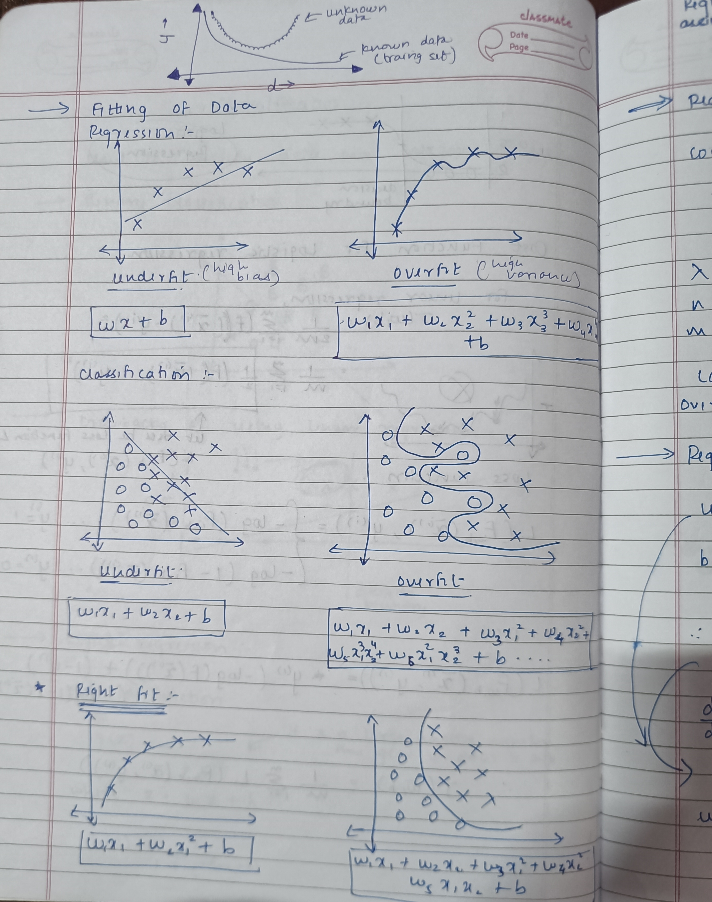

# 🏷️ Classification from Scratch

This project demonstrates how a **Classification Model** works by implementing it from scratch in Python using only basic libraries like NumPy and Matplotlib, as well as using Scikit-Learn for comparison.  
It focuses on understanding the core concepts of supervised classification, decision boundaries, and accuracy evaluation.

---

## 🧠 What I Learned

- How classification differs from regression  
- Data preprocessing and feature scaling for classification tasks  
- Implementing decision rules for classification  
- Visualizing decision boundaries in 2D  
- Evaluating performance using accuracy  

---

## ⚙️ How It Works

1. **Data Preparation** – Load dataset, preprocess, and split into train/test sets  
2. **Model Training** – Fit the classification model (from scratch and via Scikit-Learn)  
3. **Prediction** – Predict classes for new data points  
4. **Evaluation** – Measure accuracy and visualize results  
5. **Visualization** – Plot decision boundaries and class separation  

---

## 📌 How to Run

```bash
# Clone this repo
git clone https://github.com/VaibhavKhangale/Machine-Learning.git

# Navigate to this project
cd Machine-Learning/Classification

# Open the notebook
jupyter notebook FILENAME.ipynb
```

---

## Notes for Classification and Avoid overfitting using Regularization.




