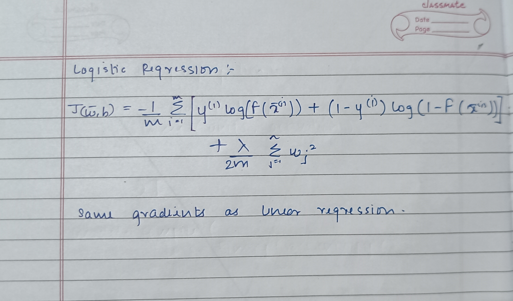

# 📈 Logistic Regression from Scratch

This project demonstrates how **Logistic Regression** works under the hood by implementing it from scratch in Python using only basic libraries like NumPy and Matplotlib, as well as using Scikit-Learn for comparison.  
It covers binary classification using the sigmoid activation function and gradient descent optimization.

---

## 🧠 What I Learned

- The mathematics behind logistic regression  
- Sigmoid (logistic) function and its role in classification  
- Binary cross-entropy loss function  
- Gradient Descent for classification tasks  
- Visualizing decision boundaries  

---

## ⚙️ How It Works

1. **Initialize Parameters** – Set initial weights and bias  
2. **Sigmoid Function** – Convert linear predictions to probabilities  
3. **Loss Function** – Binary Cross-Entropy (Log Loss)  
4. **Gradient Descent** – Update weights to minimize loss  
5. **Prediction** – Classify samples based on probability thresholds  
6. **Visualization** – Plot decision boundaries and loss curves  

---

## 📌 How to Run

```bash
# Clone this repo
git clone https://github.com/VaibhavKhangale/Machine-Learning.git

# Navigate to this project
cd Machine-Learning/Logistic Regression

# Open the notebook
jupyter notebook FILENAME.ipynb
```

---

## Notes



